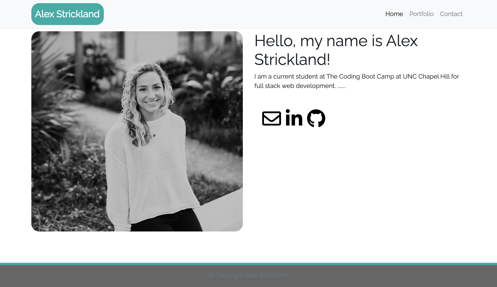

# alexhstrickland.github.io

## Description

For this project, I have created my own personal page that includes an about me page, a portfolio page, and a contact page. I used Bootstrap, Google Fonts, and Font Awesome Icons to help me style my portfolio pages. I used Bootstrap to develop a site that includes:

* a nav bar
* a responsive layout
* responsive images

Using Bootstrap's grid system, I was able to create a responsive layout using containers, rows, and columns. After the index, contact, and portfolio pages were complete, I used a validation service to check my HTML. Semantic HTML was used to meet accessibilty standards.

The project has been eployed at a live URL. To access the live URL, please click here [alexhstrickland.github.io](https://alexhstrickland.github.io/).

## Usage

When accessing the website, you can click any of the links in the upper right corner to access specific content. If you would like to view a screenshot of the website, check out .

